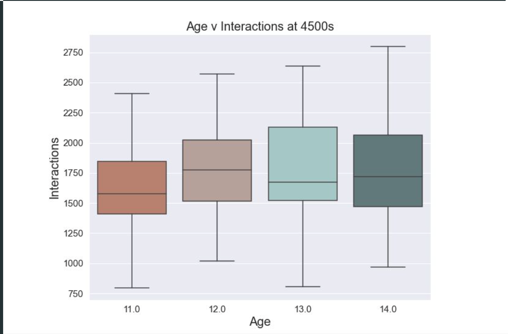

# Analyzing Player Data from the Yale School of Medicine Play2Prevent Educational Video Game (DataFest 2022)

## Table of Contents

1. [Abstract](#abstract)
2. [Acknowledgments](#acknowledgments)
   - [Team Acknowledgment](#team-acknowledgment)
   - [Data Acknowledgment](#data-acknowledgment)
3. [Background](#background)
4. [Data Description](#data-description)
   - [Variables](#variables)
5. [Exploratory Data Analysis](#exploratory-data-analysis)
   - [Age](#exploratory-data-analysis-age)
6. [Conclusion](#conclusion)
   - [Insights](#insights)
   - [Limitations](#limitations)
   - [Future Plans](#future-plans)
7. [Dependencies](#dependencies)
8. [Project Folder Structure](#project-folder-structure)
9. [Miscellaneous](#miscellaneous)
10. [Contact Information](#contact-information)

## Abstract

This data science competition submission examines the performance of adolescents in predicting risk and understanding future consequences, based on data from the Yale School of Medicine's Play2Prevent Lab Educational Videogame "Elm City Stories". The analysis aims to provide researchers from the Play2Prevent Lab at the Yale School of Medicine with actionable insights for drawing connections between real-life behavior and in-game performance behavior. Using a comprehensive dataset, the study evaluates trends in player ages, in-game skills, stacks, and interactions. Based on EDA work, players belonging to the age 11 cohort severely underperformed compared to ages 12-14, thereby failing to meet the goals by Play2Prevent to teach adolescents about risk assessment. These insights are intended to provide feedback for the Yale School of Medicine in improving certain aspects of their game design to increase retention among younger players, with future plans involving machine learning for detecting interactions among key variables. The study underscores the importance of leveraging educational videogame data to understand how different players behave and how to encourage certain desirable actions.

If you would like to see a presentation format of this project, click [here](C3Data%20Bruin%20Group.pdf).

You are also free to check out the official game by Yale School of Medicine's Play2Prevent Lab [Elm City Stories](https://schellgames.com/portfolio/playforward-elm-city-stories).

## Acknowledgments

### Team Acknowledgment

I would like to extend my gratitude towards the following students who contributed to this project:

- Tony Lei
- Terry Ming
- Derek Nakagawa
- Jeff Lu

## Data Acknowledgment

The data used in this project was provided by the Yale School of Medicine at ASA Datafest 2022 under strict privacy and security regulations. Due to privacy policies, the raw data cannot be shared.

## Background

The ASA DataFest 2022 challenge came from the Play2Prevent lab at the Yale Center for Health & Learning Games in the Yale School of Medicine. DataFest participants analyzed data from "Elm City Stories", which is an educational video game designed for middle and high school students. The goal of the game was to prevent negative health outcomes in young, at-risk adolescents by helping teens to increase perception of risk and to develop skills for predicting and understanding future consequences of actions. The DataFest challenge was to characterize, measure and display patterns of play within the game that the researchers could then use to make connections to real-life behavior.

## Data Description


## Exploratory Data Analysis




## Conclusion

### Insights

We found that those who were age 11 among the adolescents performed the worst in the videogame compared to the older ages. We believe that the game's current design is not universal as it discusses more mature topics including alocholism; as such, younger players may not be able to have a full grasp on the subject matter, thus leading them to drop the game much sooner than older players.

A suggestion to the core design of the videogame would be to add a tutorial level to ease younger players into the game so that they can play the game with the same understanding as older players. Improving the game design would enable Play2Prevent to achieve their goal of communicating educational themes to these players and getting the desirable behavior of learning these themes in-game to match that of real life.

### Limitations

- **Data Accessibility**: Due to privacy regulations set by ASA Datafest, raw data could not be exported.

- **Time Constraints**: Due to the time constraints set by the event, with the whole event taking 48 hours in duration, we were not able to fully investigate the project as extensibly as we believe we would be able to.

- **Modeling**: Although EDA helps to lay the foundation for the ideas we hope to address, modeling would help support these claims further; our mistake for doing modeling work limits the validity of our findings.

### Next Steps

We would further look into the insights regarding stacks. Then, we would look into other external factors in the dataset that were not investigated earlier.

We can further improve our project past the competition by building models to detect more insights about the data. Once we have developed, trained, and optimized our models, these models could be deployed for use under the Yale School of Medicine, by which then their researchers can implement the models' insights into improving their game design in order to properly communicate the ideas through their videogame to adolescents.

## Dependencies

- pandas
- numpy
- matplotlib
- seaborn
- scipy
- stringr
- ggplot2
- dplyr
- tidyverse
- stringi
- ggrepel

## Project Folder Structure

```plaintext

```

## Miscellaneous 

Main Github Repo for Data Bruin Group @ DataFest 2022

Around 80 groups in attendance - advanced to final round of 15 teams

## Contact Information

For any questions, please contact:

- Name: Christopher Fu
- Email: christopherfuwas@gmail.com
